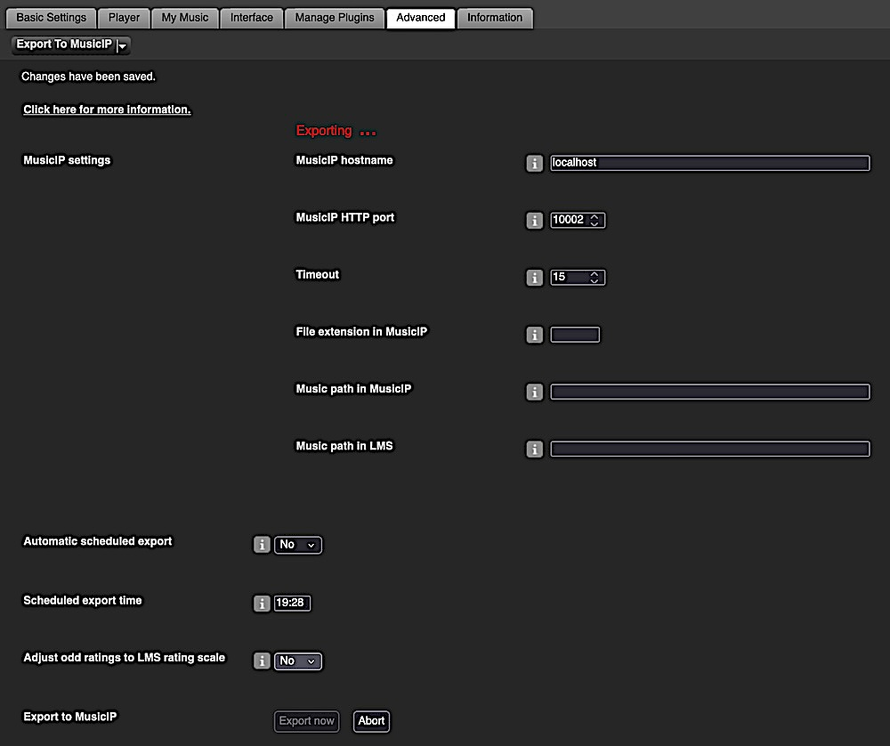

Export To MusicIP
====

Plugin to export rating, play count and date last played values of your **local** music files from LMS to MusicIP. 

⚠️ **I'm not maintaining this plugin. I don't provide support for it.** And I don't use MusicIP.
  

## Requirements

- LMS version >= 7.**9**
- LMS database = SQLite

  

## Screenshots[^1]

   

## Installation

### Using the repository URL

- Add the repository URL below at the bottom of *LMS* > *Settings* > *Plugins* and click *Apply*: 
[https://raw.githubusercontent.com/AF-1/sobras/main/repos/lmsghonly/public.xml](https://raw.githubusercontent.com/AF-1/sobras/main/repos/lmsghonly/public.xml)

- Install the plugin from the added repository at the bottom of the page.

 

### Manual Install

Please read the instructions on how to [install a plugin manually](https://github.com/AF-1/sobras/wiki/Manual-installation-of-LMS-plugins).
    

## FAQ

»<b>How to verify in MusicIP that the export was a success</b>«
 

The export results can be confirmed by opening the MIP cache in the windows version of MIP. <i>Last Played</i> and <i>Ratings</i> can be added to the visible columns if not already there.  

- Cache file location: 

     - Windows: C:\Users\<YOUR USERNAME>\AppData\Roaming\MusicIP\MusicIP Mixer\default.m3lib 

     - Linux: ~/.MusicMagic

 

»<b>How to troubleshoot issues</b>«
 

Go to <i>LMS Settings > Advanced > Export to MusicIP</i> and set the debug level of this plugin to <i>Info</i>. Check the server.log for relevant error messages and warnings. If you need to ask for support in the LMS forum, set the debug level to <i>debug</i> and include the log in your post.

 

[^1]: The screenshots might not correspond to the UI of the latest release in every detail.
